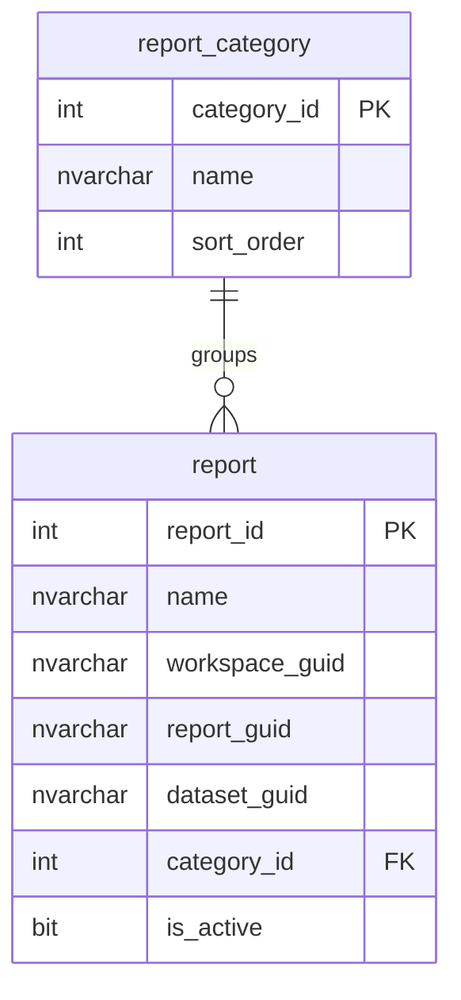

# ERD — EBI database

> Generated from the live schema by `/sync-docs` (read-only `ebi-sql-dev` MCP).
> Do not edit by hand; rerun `/sync-docs` after applying migrations.

_Placeholder reflecting `V1__init.sql`. Will be regenerated from the live schema._
