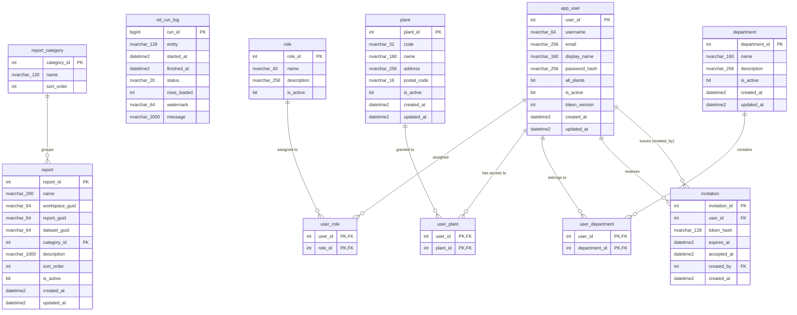

# ERD — EBI database

> Generated from the live schema by `/sync-docs` (read-only `ebi-sql-dev` MCP).
> Do not edit by hand; rerun `/sync-docs` after applying migrations.
>
> Last synced: 2026-06-27. Reflects V1 + V2 + V3 + V4 (V4 pending `flyway migrate`; re-run `/sync-docs` after applying).

