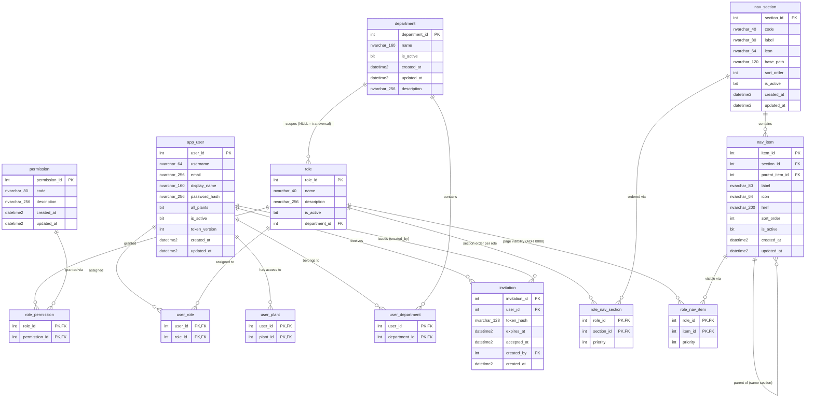

# ERD — esquema `auth`

> Generado desde el esquema vivo (`ebi-sql-dev`, read-only). No editar a mano; lo regenera
> el sub-agente `docs-sync` al cierre de cada `/build-plan`.
>
> Última sincronización: 2026-07-14. Refleja V1 + V2 + V3 + V4 + V7 + V8 + V15 +
> V16 (+ semillas de V20) (V5/V6 pertenecen al esquema `maint`, ver
> `docs/database/erd/maint.md`). V15 transfirió `auth.plant` → `org.plant` (ver
> `docs/database/erd/org.md`); `user_plant` permanece en `auth`. V16 añadió
> `role_nav_item` (visibilidad de navegación POR PÁGINA, ADR 0008) y redujo la
> semántica de `role_nav_section` a solo orden de secciones por rol. **V20 (plan
> laser-cut-sequencing) no cambió la estructura de `auth`**: solo insertó
> semillas (ver "Semillas de V20" más abajo).

## FKs hacia otros esquemas

- `auth.user_plant.plant_id` → `org.plant.plant_id` (sin cascade). La tabla
  `user_plant` (scope de identidad: qué plantas ve un usuario) sigue en `auth`;
  su FK cruza a `org` desde V15, cuando `plant` se transfirió a `org` (ver
  `docs/database/erd/org.md`).

## FKs entrantes desde otros esquemas (V20)

- `planning.machine_program.created_by` → `auth.app_user.user_id` (sin cascade;
  se preserva la autoría del programa de secuenciación). Ver
  `docs/database/erd/planning.md`.

## Semillas de V20 (plan laser-cut-sequencing)

No hay cambios de DDL en `auth`; V20 solo siembra filas (patrón guardado,
idempotente, precedente V7/V8/V9/V19):

- `nav_section`: sección `planning` (label `Planeación`, icon `ClipboardCheck`,
  `base_path = /planning`, `sort_order = 40`, **`is_active = 0` — dark launch**,
  precedente V7 con `maintenance`).
- `nav_item`: `Secuenciación láser` → `/planning/laser-sequencing`
  (`sort_order = 10`, icon `Layers`) bajo la sección `planning`.
- `permission`: 4 códigos `planning.*` — `planning.program:create`,
  `planning.program:update`, `planning.program:delete`,
  `planning.station_link:manage` (nota: el formato de código rechaza el guión,
  por eso `station_link`, no `station-link`). No se siembra ningún
  `role_permission` (admin bypass, ADR 0004).
