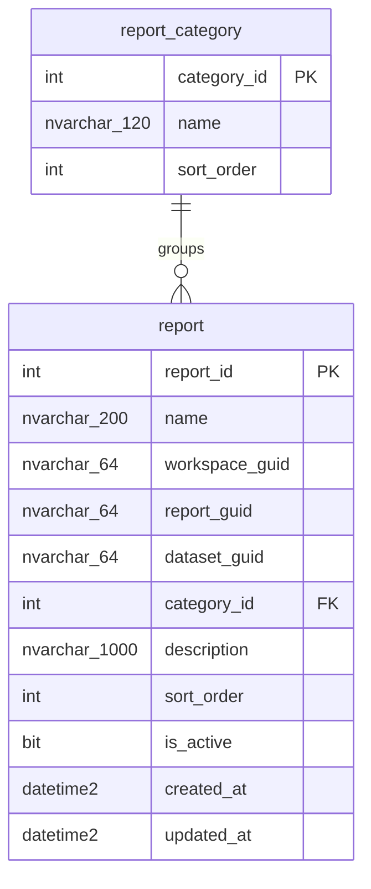

# ERD — esquema `dbo`

> Generado desde el esquema vivo (`ebi-sql-dev`, read-only). No editar a mano; lo regenera
> el sub-agente `docs-sync` al cierre de cada `/build-plan`.
>
> Última sincronización: 2026-06-28. Refleja V1 + V2 + V3 + V4.

