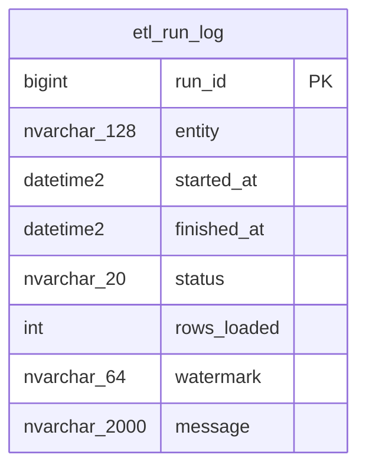

# ERD — esquema `etl`

> Generado desde el esquema vivo (`ebi-sql-dev`, read-only). No editar a mano; lo regenera
> el sub-agente `docs-sync` al cierre de cada `/build-plan`.
>
> Última sincronización: 2026-07-14. Refleja V1 + V2 + V3 + V4. **V20 (plan
> laser-cut-sequencing) no cambió la estructura de `etl`**: es el primer plan
> que *escribe* en `etl.run_log` (el ETL on-prem de corte láser) y otorga a
> `ebi_etl` SELECT/INSERT/UPDATE sobre el esquema (sin DELETE — es bitácora). El
> portal lee `etl.run_log` como indicador de frescura (`ebi_app` = SELECT).

Este esquema no tiene relaciones declaradas con otras tablas en el ERD actual.

## Valores de `run_log.entity` en uso (V20)

El ETL de corte láser (`etl/run.mjs`) escribe **una fila por entidad por
corrida** con `status` (`running` → `success`/`error`), `rows_loaded`,
`watermark` (máximo `eps_nesting_id` cargado, solo para `eps_nesting`) y
`message`. Los valores de `entity` que emite son exactamente los cinco nombres
de tabla de `staging`:

- `eps_nesting`
- `eps_nesting_detail`
- `eps_nesting_plan`
- `eps_cutting_station`
- `eps_part_route_step`

El panel de secuenciación deriva la frescura del ETL del `finished_at`/`status`
más reciente por entidad (`etlFreshness` en
`src/modules/planning/db/nesting.ts`; heurística de obsolescencia en
`src/modules/planning/format.ts`).
