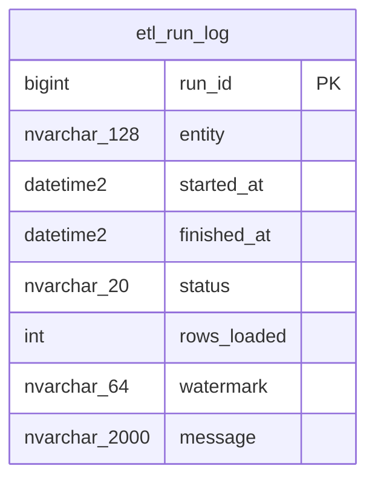

# ERD — esquema `etl`

> Generado a partir de `docs/database/erd.md`. No editar a mano; regenerar con `/sync-docs`.
>
> Última sincronización: 2026-06-28. Refleja V1 + V2 + V3 + V4.

Este esquema no tiene relaciones declaradas con otras tablas en el ERD actual.
