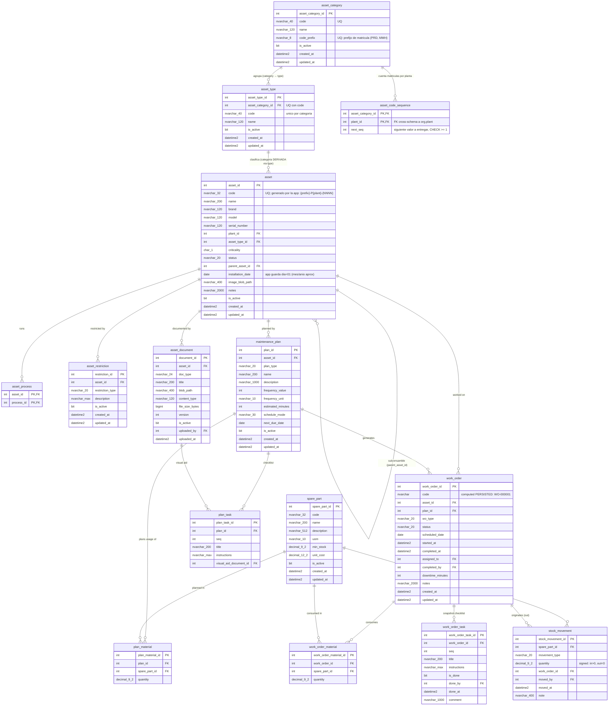

# ERD — esquema `maint`

> Generado a partir de las migraciones aplicadas `V5__maint_asset_catalog.sql`,
> `V6__maint_plans_workorders_spares.sql`, `V11__produccion_schema.sql` y
> `V17__maint_asset_catalog_redesign.sql`. No editar a mano; lo regenera el
> sub-agente `docs-sync` al cierre de cada `/build-plan`.
>
> Última sincronización: 2026-07-08. Refleja V5 + V6 + V11 + V15 + V17 (V17
> desde el archivo de migración aplicado + tipos Kysely regenerados, no
> introspección en vivo). V15 promovió `maint.process` → `org.process` (ver
> `docs/database/erd/org.md`); `asset_process` permanece en `maint`. V17
> rediseña el catálogo de activos: `asset_category`/`asset_type` como catálogos
> configurables, contador `asset_code_sequence` para la matrícula, y cambios de
> columnas en `asset` (ver notas al pie).

## FKs hacia otros esquemas

- `asset.plant_id` → `org.plant.plant_id` (sin cascade; antes `auth.plant`, movida en V15).
- `asset_code_sequence.plant_id` → `org.plant.plant_id` (sin cascade; V17).
- `asset_process.process_id` → `org.process.process_id` (sin cascade; antes `maint.process`, promovida en V15).
- `asset_document.uploaded_by` → `auth.app_user.user_id` (sin cascade).
- `work_order.assigned_to`, `work_order.completed_by` → `auth.app_user.user_id` (sin cascade).
- `work_order_task.done_by` → `auth.app_user.user_id` (sin cascade).
- `stock_movement.moved_by` → `auth.app_user.user_id` (sin cascade).

FK entrante desde otro esquema: `production.asset_cell_assignment.asset_id` →
`maint.asset.asset_id` (sin cascade; ver [production.md](production.md)).

## Notas de diseño (V5/V6/V11/V17)

- Enumeraciones vía `CHECK` constraints con nombre (sin tablas lookup) —
  **con la excepción introducida en V17**: `asset_category`/`asset_type` son
  las primeras dimensiones de `maint` modeladas como catálogos configurables
  en lugar de CHECKs (jerarquía categoría→tipo configurable por el usuario +
  prefijo de matrícula). `criticality` y `status` siguen siendo CHECKs.
- Soft-delete con `is_active`; `updated_at` lo mantiene la app (sin triggers).
- Stock = solo ledger (`stock_movement`, append-only, cantidad **con signo**);
  stock actual = `SUM(quantity)` por refacción (índice cubriente `IX_stock_movement_part`).
- `work_order.code` es columna calculada PERSISTED (`WO-` + identity a 6 dígitos)
  con índice único `UQ_work_order_code`.
- Las work orders son historia: sin cascades hacia ellas; solo sus filas hijas
  (`work_order_task`, `work_order_material`) cascadean desde su cabecera.
- Cascades restantes: `asset` → `asset_process`, `asset_restriction`;
  `maintenance_plan` → `plan_task`, `plan_material`.
- V17 promueve la dimensión `asset_category` (añadida por V11 como CHECK en
  `asset`) a los catálogos `asset_category` (semillas: `production_equipment`
  → PRD, `material_handling` → MMH) y `asset_type`. La categoría de un activo
  es **derivada** vía `asset → asset_type → asset_category`; nunca se guarda
  en `asset`.
- `asset.code` (matrícula) sigue siendo `UNIQUE` pero desde V17 la **genera la
  app** (`{code_prefix}-P{plant_id}-{NNNN}`, nunca input del usuario) dentro
  de la transacción de inserción, reclamando `asset_code_sequence.next_seq`
  bajo `UPDLOCK + SERIALIZABLE` (contador race-safe por (categoría, planta);
  sin triggers ni DEFAULT en la columna). `UQ_asset_code` es el respaldo final.
- V17 también renombra `acquisition_date` → `installation_date`, añade
  `image_blob_path` (foto principal; contenedor blob `maintenance`) y **elimina
  `asset.location`** (texto libre): la ubicación física la historiza
  `production.asset_cell_assignment` (esquema creado como `produccion` en V11
  y renombrado en V12).
- V17 siembra 6 códigos en `auth.permission`
  (`maintenance.asset_category:{create,update,delete}`,
  `maintenance.asset_type:{create,update,delete}`); sin filas
  `role_permission` ni nav item nuevo (la administración de catálogos es una
  pestaña dentro de `/maintenance/machines`).
