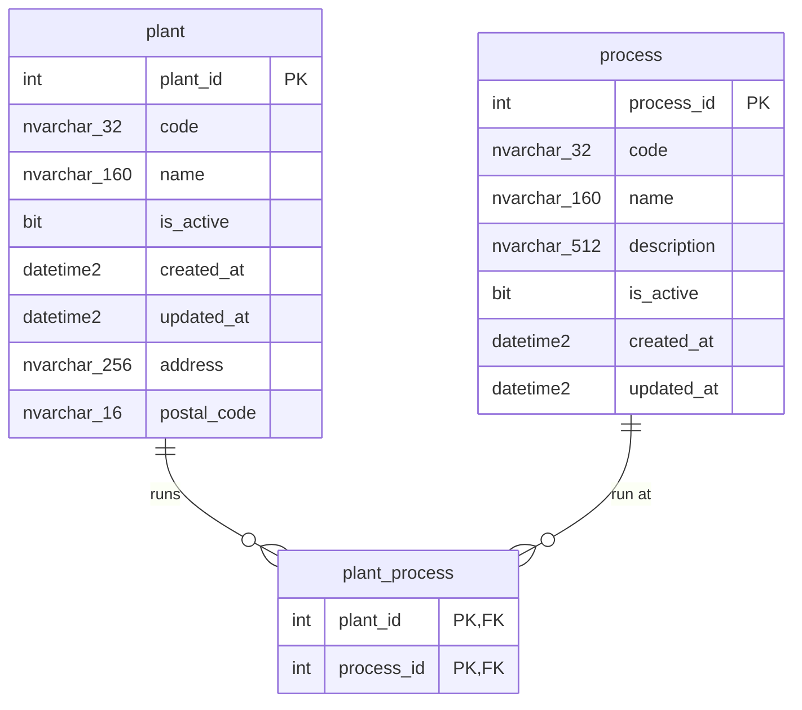

# ERD — `org` schema

> Generated from the applied migration `V15__org_schema_plant_process.sql`
> (Flyway schema version 15 in `EBI_dev`; Kysely types regenerated via
> `pnpm db:gen` — 36 tables). V15 creates the `org` schema by transferring
> `auth.plant` → `org.plant` and `maint.process` → `org.process`
> (`ALTER SCHEMA TRANSFER`, columns unchanged) and adds the new N:M link
> `org.plant_process`. Do not edit by hand; the `docs-sync` sub-agent
> regenerates it at the close of each build.
>
> Last synced: 2026-07-07. Reflects V15. See ADR
> `docs/architecture/adr/0007-org-schema-identity-vs-organization.md`.

Organization-of-the-company entities, distinct from identity (`auth`): the
canonical plant catalog, the canonical **company-wide** process catalog, and
which processes each plant runs. The line is: `org` = *what the company is*
(sites, processes, and how they relate); `auth` = *who may act*.

## FKs entrantes desde otros esquemas

Todas re-apuntan automáticamente por `object_id` tras el `ALTER SCHEMA
TRANSFER` (ninguna se recreó). Ninguna con cascade:

- `auth.user_plant.plant_id` → `org.plant.plant_id` (antes `auth.plant`).
- `maint.asset.plant_id` → `org.plant.plant_id` (antes `auth.plant`).
- `maint.asset_process.process_id` → `org.process.process_id` (antes `maint.process`).
- `production.production_line.plant_id` → `org.plant.plant_id` (antes `auth.plant`).
- `production.cell.plant_id` → `org.plant.plant_id` (antes `auth.plant`).
- `production.plant_layout.plant_id` → `org.plant.plant_id` (antes `auth.plant`).

## Notas de diseño (V15)

- **`ALTER SCHEMA TRANSFER` es metadata-only:** `plant` (de `auth`) y `process`
  (de `maint`) se movieron **sin cambio de columnas**; filas, FKs (ligadas por
  `object_id` — sobreviven intactas), CHECKs, defaults, índices y estadísticas
  se mueven con la tabla. Los nombres de constraint/índice no llevan prefijo de
  esquema (convención del repo: `PK_plant`, `UQ_plant_code`, `PK_process`,
  `UQ_process_code`, …), así que **ningún nombre cambia y ninguna FK se recreó**.
- **`org.plant_process` es una link-row** (solo `plant_id, process_id`, sin
  `is_active`/timestamps/`sort_order`) — misma forma que `maint.asset_process`.
  Un `process_id` se repite libremente entre plantas (un único "Corte láser"
  asignado a las plantas 1, 2, 6). Desasignar = `DELETE` de la fila (nada la
  referencia aguas abajo). Ambas FKs son `NO ACTION` para proteger los
  catálogos `org.plant` / `org.process` (la app responde 409). `sort_order` es
  un `ALTER ADD` reversible trivial si el futuro route UI necesita orden. El
  índice `IX_plant_process_process (process_id)` sirve el lookup inverso "qué
  plantas corren el proceso X" (el lookup directo "qué procesos en la planta Y"
  ya lo sirve la columna líder `plant_id` de la PK) — mismo patrón que
  `IX_asset_process_process` (V5).
- Grants del esquema `org`: `ebi_app` = SELECT/INSERT/UPDATE/DELETE;
  `ebi_agent_ro` = SELECT (guarded, idempotente — los grants con alcance de
  esquema **no** siguen a los objetos transferidos, por eso `org` recibe los
  suyos; `auth`/`maint` conservan los suyos). `ebi_migrator` es dueño del
  esquema (sin GRANT DDL explícito, como en toda migración de esquema previa).
- **Administración del catálogo de procesos:** se movió del módulo de
  mantenimiento al panel admin (grupo Organización), junto a
  plantas/departamentos/roles. Mantenimiento conserva solo el enlace
  activo↔proceso (`maint.asset_process`). V15 retira los permisos
  `maintenance.process:*` y el nav item `Procesos` de mantenimiento
  (`/maintenance/process`).
