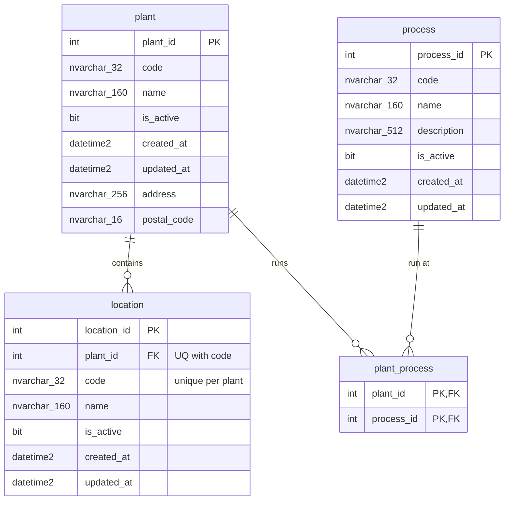

# ERD — `org` schema

> Generated from the applied migrations `V15__org_schema_plant_process.sql` and
> `V18__org_locations_type_processes.sql` (V18 sourced from the adopted-from-live
> migration file + regenerated Kysely types — 41 tables — not live
> introspection). V15 created the `org` schema by transferring
> `auth.plant` → `org.plant` and `maint.process` → `org.process`
> (`ALTER SCHEMA TRANSFER`, columns unchanged) and added the N:M link
> `org.plant_process`. V18 adds `org.location` — named locations within a
> plant. Do not edit by hand; the `docs-sync` sub-agent regenerates it at the
> close of each build.
>
> Last synced: 2026-07-08. Reflects V15 + V18. See ADR
> `docs/architecture/adr/0007-org-schema-identity-vs-organization.md`.

Organization-of-the-company entities, distinct from identity (`auth`): the
canonical plant catalog, named locations within each plant, the canonical
**company-wide** process catalog, and which processes each plant runs. The
line is: `org` = *what the company is* (sites, locations, processes, and how
they relate); `auth` = *who may act*.

## FKs entrantes desde otros esquemas

Ninguna con cascade:

- `auth.user_plant.plant_id` → `org.plant.plant_id` (antes `auth.plant`).
- `maint.asset.location_id` → `org.location.location_id` (V18; sustituye la
  antigua `maint.asset.plant_id` → `org.plant`, eliminada en V18 — la planta
  de un activo ahora se DERIVA vía `location.plant_id`).
- `maint.asset_code_sequence.plant_id` → `org.plant.plant_id` (V17, re-creada
  en V18 al re-clavar la tabla por (type, plant)).
- `maint.asset_type_process.process_id` → `org.process.process_id` (V18;
  sustituye a `maint.asset_process.process_id`, tabla eliminada en V18).
- `production.cell.location_id` → `org.location.location_id` (obligatoria
  desde V19 — antes NULLable desde V18; `production.cell.plant_id` fue
  eliminada en V19, la planta de una celda ahora se DERIVA vía
  `location.plant_id`; `production.production_line.plant_id` desapareció al
  eliminarse esa tabla en V19).
- `production.cell.process_id` → `org.process.process_id` (V19, NULLable).
- `production.cell_code_sequence.location_id` → `org.location.location_id` (V19).
- `production.plant_layout.plant_id` → `org.plant.plant_id` (antes `auth.plant`).

## Notas de diseño (V15)

- **`ALTER SCHEMA TRANSFER` es metadata-only:** `plant` (de `auth`) y `process`
  (de `maint`) se movieron **sin cambio de columnas**; filas, FKs (ligadas por
  `object_id` — sobreviven intactas), CHECKs, defaults, índices y estadísticas
  se mueven con la tabla. Los nombres de constraint/índice no llevan prefijo de
  esquema (convención del repo: `PK_plant`, `UQ_plant_code`, `PK_process`,
  `UQ_process_code`, …), así que **ningún nombre cambia y ninguna FK se recreó**.
- **`org.plant_process` es una link-row** (solo `plant_id, process_id`, sin
  `is_active`/timestamps/`sort_order`) — misma forma que
  `maint.asset_type_process` (V18). Un `process_id` se repite libremente entre
  plantas (un único "Corte láser" asignado a las plantas 1, 2, 6). Desasignar =
  `DELETE` de la fila (nada la referencia aguas abajo). Ambas FKs son
  `NO ACTION` para proteger los catálogos `org.plant` / `org.process` (la app
  responde 409). `sort_order` es un `ALTER ADD` reversible trivial si el futuro
  route UI necesita orden. El índice `IX_plant_process_process (process_id)`
  sirve el lookup inverso "qué plantas corren el proceso X" (el lookup directo
  "qué procesos en la planta Y" ya lo sirve la columna líder `plant_id` de la
  PK).
- Grants del esquema `org`: `ebi_app` = SELECT/INSERT/UPDATE/DELETE;
  `ebi_agent_ro` = SELECT (guarded, idempotente — los grants con alcance de
  esquema **no** siguen a los objetos transferidos, por eso `org` recibe los
  suyos; `auth`/`maint` conservan los suyos; V18 los re-emite idempotentemente).
  `ebi_migrator` es dueño del esquema (sin GRANT DDL explícito, como en toda
  migración de esquema previa).
- **Administración del catálogo de procesos:** se movió del módulo de
  mantenimiento al panel admin (grupo Organización), junto a
  plantas/departamentos/roles. Desde V18 el enlace proceso↔equipo vive en el
  **tipo** de equipo (`maint.asset_type_process`), no en cada activo. V15
  retiró los permisos `maintenance.process:*` y el nav item `Procesos` de
  mantenimiento (`/maintenance/process`).

## Notas de diseño (V18 — `org.location`)

- **`org.location` = ubicaciones con nombre DENTRO de una planta** ("Nave 2",
  "Almacén MP"). `code` es único por planta (`UQ_location_plant_code
  (plant_id, code)`, que además sirve de índice de soporte de la FK por su
  columna líder — mismo patrón que `UQ_asset_type_category_code`). FK
  `FK_location_plant` sin cascade (catálogo protegido; la app responde 409).
- Es el nuevo ancla de la ubicación física: `maint.asset.location_id` es
  NOT NULL (la planta del activo se deriva) y `production.cell.location_id`
  es NULLable (una celda puede vivir dentro de una ubicación). La invariante
  entre ambos (celda y activo asignado comparten ubicación) la aplica la app,
  no la DB (sin triggers).
- V18 siembra 3 códigos en `auth.permission`
  (`org.location:{create,update,delete}`); sin filas `role_permission` (admin
  hace bypass en la capa app, ADR 0004) ni nav item (la administración de
  ubicaciones vive dentro de la pestaña Plantas del panel admin).
