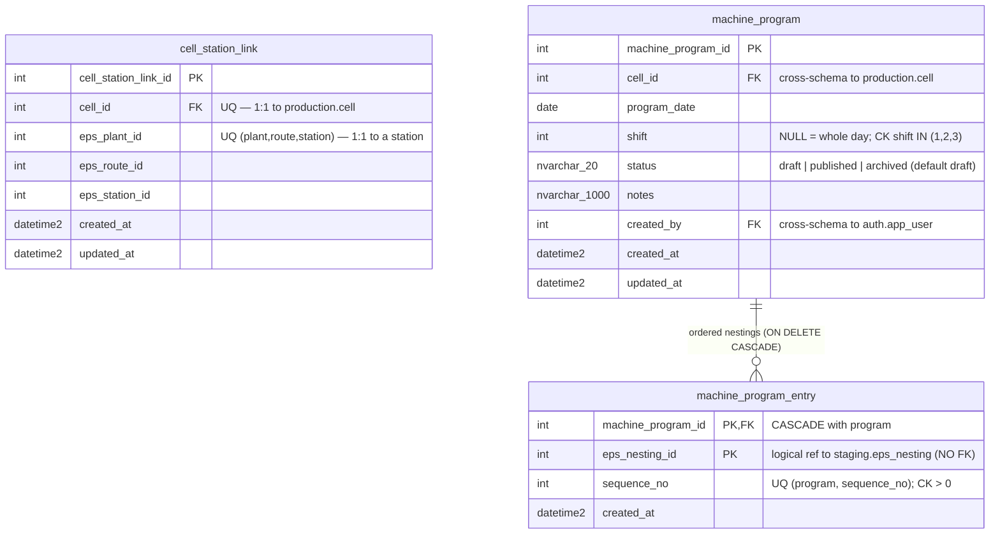

# ERD — `planning` schema

> Generated from the applied migration `V20__laser_cut_sequencing.sql` +
> regenerated Kysely types (`src/lib/db/types.ts`), not direct introspection
> (`ebi-sql-dev` MCP not used this session). Do not edit by hand; the
> `docs-sync` sub-agent regenerates it at the close of each build.
>
> Last synced: 2026-07-14. Reflects V20 — the `planning` schema is **born this
> plan** (laser-cut-sequencing). Portal-owned (`ebi_app` CRUD): per-cell laser
> sequence programs plus the EBI cell ↔ EPS station mapping. Distinct from the
> ETL-owned `staging` replica ([staging.md](staging.md)) it reads from.

## Cross-schema FKs

- `cell_station_link.cell_id` → `production.cell.cell_id` (no cascade — protect
  the cell catalog; the app returns 409 on a linked cell). `UQ_cell_station_link_cell`
  (unique `cell_id`) + `UQ_cell_station_link_station` (unique
  `eps_plant_id, eps_route_id, eps_station_id`) make the mapping **1:1 both
  ways**.
- `machine_program.cell_id` → `production.cell.cell_id` (no cascade — protect
  the cell catalog).
- `machine_program.created_by` → `auth.app_user.user_id` (no cascade —
  authorship history is preserved).
- `machine_program_entry.machine_program_id` → `planning.machine_program.machine_program_id`
  **ON DELETE CASCADE** (entries are config owned by their parent program; the
  `nav_item` precedent).

**Deliberately no FK:** `machine_program_entry.eps_nesting_id` references
`staging.eps_nesting` **logically only**. `staging` is an ETL-owned replica that
must stay re-baselinable, so the app validates the nesting's existence at insert
(`addEntry` in `src/modules/planning/db/program.ts`) instead of the DB. All
declared FKs are NO ACTION except the entry→program cascade.

## Design notes (V20)

- **`machine_program` lifecycle: `draft → published → archived`**
  (`CK_machine_program_status`). The **filtered unique index
  `UQ_machine_program_published` `(cell_id, program_date, shift) WHERE status =
  'published'`** guarantees at most one published program per cell/date/shift.
  SQL Server treats NULLs as equal in a unique index, so a NULL-shift
  ("whole day") program is unique per cell/date too — intended (v1 works per
  whole day, `shift = NULL`). Publishing archives the previous published
  program for the same cell/date/shift in one transaction (`publishProgram`),
  keeping history without violating the index. `IX_machine_program_cell`
  `(cell_id, program_date DESC)` serves the per-cell timeline read.
- **No `name` column in v1** — a program's identity is `cell + date + shift`.
- **`machine_program_entry` carries both invariants in the DB:** composite
  natural PK `(machine_program_id, eps_nesting_id)` (a nesting appears at most
  once per program) + `UQ_machine_program_entry_sequence`
  `(machine_program_id, sequence_no)` (unique order) + `CK` `sequence_no > 0`.
  Because the CHECK forbids `≤ 0`, the app's reorder uses a **positive-offset
  two-pass** update (`seq + 1_000_000`, then final `(i+1)*10`) to dodge the
  unique index mid-update (`reorderPasses` / `reorderEntries`).
- **`shift` domain is EPS `Turno` (1..3), verified** —
  `CK_machine_program_shift` allows `NULL` or `1,2,3`.
- **Grants (V20):** `ebi_app` = SELECT/INSERT/UPDATE/DELETE on schema
  `planning`; `ebi_agent_ro` = SELECT. `planning` is portal-owned; the ETL has
  no access to it.
