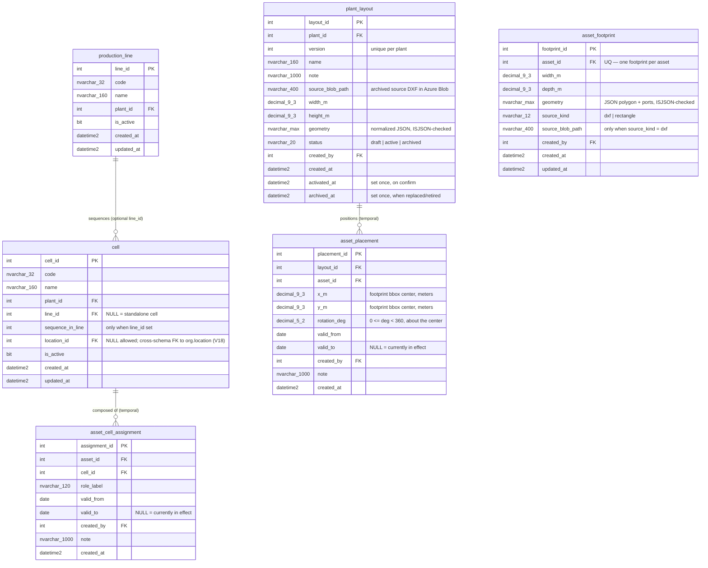

# ERD — `production` schema

> Generated from the applied migrations `V11__produccion_schema.sql`,
> `V12__rename_produccion_schema_to_production.sql` and
> `V13__production_plant_layout.sql` (Flyway schema version 13 in `EBI_dev`,
> confirmed via `flyway_schema_history` this session; Kysely types regenerated
> via `pnpm db:gen` — 35 tables). V12 renamed the schema `produccion` →
> `production`; V13 added the three plant-layout tables. Do not edit by hand;
> the `docs-sync` sub-agent regenerates it at the close of each build.
>
> Last synced: 2026-07-08. Reflects V11 + V12 + V13 + V15 + V18. V15 did not
> change `production`'s tables; it transferred `auth.plant` → `org.plant`, so
> the `plant_id` FKs below now cross to `org` (re-pointed by `object_id`, not
> recreated). V18 added `cell.location_id` (NULLable FK to the new
> `org.location`). V18 sourced from the adopted-from-live migration file +
> regenerated Kysely types, not direct introspection. See
> `docs/database/erd/org.md`.

## Cross-schema FKs

- `production_line.plant_id` → `org.plant.plant_id` (no cascade; was `auth.plant` before V15).
- `cell.plant_id` → `org.plant.plant_id` (no cascade; was `auth.plant` before V15).
- `cell.location_id` → `org.location.location_id` (no cascade; NULLable, V18;
  filtered index `IX_cell_location (location_id) WHERE location_id IS NOT NULL`).
- `asset_cell_assignment.asset_id` → `maint.asset.asset_id` (no cascade: history
  survives the asset being retired).
- `asset_cell_assignment.created_by` → `auth.app_user.user_id` (no cascade:
  authorship history preserved).
- `plant_layout.plant_id` → `org.plant.plant_id` (no cascade; was `auth.plant` before V15).
- `plant_layout.created_by` → `auth.app_user.user_id` (no cascade).
- `asset_footprint.asset_id` → `maint.asset.asset_id` (no cascade).
- `asset_footprint.created_by` → `auth.app_user.user_id` (no cascade).
- `asset_placement.asset_id` → `maint.asset.asset_id` (no cascade).
- `asset_placement.created_by` → `auth.app_user.user_id` (no cascade).

All FKs are NO ACTION — catalog rows and history are protected, never cascaded.

## Design notes (V11)

- **Temporal M:N bridge, historized.** `asset_cell_assignment` records asset ↔
  cell composition over time: a cell can hold several assets and one asset can
  serve several cells simultaneously (e.g. a shared feed tower on "Laser 1" and
  "Laser 2"). A reassignment is *close the current row (`valid_to`) + open a new
  one* — `asset_id`/`cell_id` are never UPDATEd in place.
- **No `updated_at` on `asset_cell_assignment`, on purpose.** Rows are immutable
  once written except for closing `valid_to`; an `updated_at` would invite the
  in-place rewrite this design exists to prevent.
- **Filtered unique index `UQ_asset_cell_assignment_current`**
  `(asset_id, cell_id) WHERE valid_to IS NULL`: at most one *current* row per
  (asset, cell) pair, without limiting how many distinct cells an asset serves
  or how many assets a cell holds. `IX_asset_cell_assignment_asset` /
  `IX_asset_cell_assignment_cell` `(…, valid_from)` serve "where is asset X" and
  "what is in cell Y" plus their histories.
- **`cell.line_id` is nullable** — standalone cells ("Laser 1") have no line.
  `sequence_in_line` requires a line (`CK_cell_sequence_requires_line`, and
  `CK_cell_sequence` > 0); the filtered unique index `UQ_cell_line_sequence`
  `(line_id, sequence_in_line) WHERE line_id IS NOT NULL` prevents a duplicate
  "Op 20" within one line.
- Enumerations via named CHECK constraints, soft-delete via `is_active`,
  app-maintained `updated_at` (no triggers) — same house pattern as `maint`
  (V5/V6).
- Companion change in `maint`: V11 also added `maint.asset.asset_category`
  (`production_equipment` | `material_handling`) — see
  [maint.md](maint.md). Material-handling equipment shares the maintenance
  catalog but typically has no fixed cell (shared plant pool), so assignment
  rows stay optional for that category.
- Grants: `ebi_app` = SELECT/INSERT/UPDATE/DELETE on schema `production`;
  `ebi_agent_ro` = SELECT (guarded, idempotent; re-issued by V12 after the
  schema rename — schema-scoped grants do not survive `DROP SCHEMA`). V13
  added **no** new grants: the V12 schema-level grants cover the new tables.

## Design notes (V13 — plant layout)

- **`plant_layout` is an immutable, versioned canvas per plant.** A DXF upload
  is parsed into normalized JSON and lands as a `draft`; confirming it
  activates the draft and archives the previous `active`. Geometry is never
  edited in place — a correction is a new upload = a new version (ADR 0006).
  `UQ_plant_layout_plant_version (plant_id, version)` numbers the versions;
  the **filtered unique index `UQ_plant_layout_active` `(plant_id) WHERE
  status = N'active'`** guarantees exactly one active layout per plant (drafts
  and archived versions are unconstrained).
- **No generic `updated_at` on `plant_layout`** — the only legitimate mutations
  are lifecycle transitions, captured explicitly by `activated_at` /
  `archived_at` (same reasoning as `asset_cell_assignment`).
- **Geometry is JSON in `NVARCHAR(MAX)` (`ISJSON` CHECK), not the native
  GEOMETRY type:** rendering happens client-side, no server-side spatial
  predicates exist yet, and DXF-derived payloads (zones / aisles /
  route-centerlines / ports + metadata) do not map cleanly onto OGC
  primitives. Revisit only when a real spatial query appears.
- **`asset_footprint` is ONE top-view shape per asset**
  (`UQ_asset_footprint_asset`, which doubles as the FK-support index) and is
  **editable in place** (`created_at`/`updated_at`, app-maintained): footprint
  shape is presentation, not history. `CK_asset_footprint_source_kind`
  (`dxf` | `rectangle`) and `CK_asset_footprint_source_path` (a rectangle has
  no source file; only a `dxf` footprint may archive `source_blob_path`).
- **`asset_placement` is the temporal position of an asset on a layout** —
  same invariant family as `asset_cell_assignment`: reposition = close the
  current row (`valid_to`) + insert a new one; `x_m`/`y_m`/`rotation_deg` are
  never UPDATEd in place, and there is **no `updated_at` on purpose**.
  `CK_asset_placement_rotation` (`0 ≤ deg < 360`), `CK_asset_placement_range`
  (`valid_to ≥ valid_from` or NULL).
- **Filtered unique index `UQ_asset_placement_current` `(layout_id, asset_id)
  WHERE valid_to IS NULL`**: one *current* placement per asset **per layout**
  — deliberately NOT per asset globally, so a draft layout can be populated
  while the active layout still holds the asset's live position (the
  draft-preparation overlap window). Physical truth ("where is the asset
  really") = current placement JOIN its layout WHERE `status = 'active'`;
  `UQ_plant_layout_active` guarantees that join yields at most one row per
  plant. On activation the app closes the outgoing layout's open rows and
  inserts fresh rows on the new version (carry-forward); archived layouts keep
  their closed history untouched. `IX_asset_placement_layout` /
  `IX_asset_placement_asset` `(…, valid_from)` serve composition and history
  queries.
- **Cross-schema invariant enforced by the app, not the DB** (house style: no
  triggers): the asset's plant must match `plant_layout.plant_id` for a
  placement — validated by the API when creating placements (422 otherwise).
  Since V18 the asset's plant is **derived** via
  `maint.asset.location_id → org.location.plant_id` (the direct
  `asset.plant_id` column was dropped).
- Blob paths only, never content: `source_blob_path` points at the archived
  original DXF in the private `production` container (account `ezistorage`).

## Design notes (V18 — cell location)

- **`cell.location_id` is a NULLable cross-schema FK to `org.location`** — a
  cell may sit inside a named location within its plant. Filtered index
  `IX_cell_location` only pays for linked rows (same pattern as
  `IX_asset_parent`, V5). Existing cells stayed NULL at apply time.
- **App-enforced invariant (no triggers):** creating or reassigning an
  `asset_cell_assignment` requires `cell.location_id` to be set **and** equal
  to `maint.asset.location_id` (the APIs return 422 otherwise). Moving an
  asset to another location auto-closes its current assignments (historized
  close via `valid_to`, never a delete) — done by the maintenance asset PATCH.
- The API layer also validates that a cell's `location_id` belongs to the
  cell's own plant (422) when creating/updating cells.
