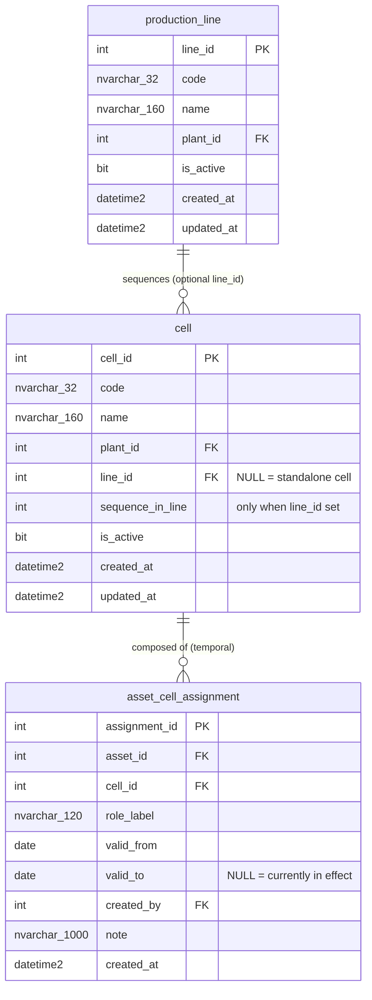

# ERD — `production` schema

> Generated from the applied migrations `V11__produccion_schema.sql` and
> `V12__rename_produccion_schema_to_production.sql` (Flyway schema version 12 in
> `EBI_dev`; Kysely types regenerated via `pnpm db:gen`). V12 renamed the schema
> `produccion` → `production` (ALTER SCHEMA TRANSFER); tables, columns,
> constraints, indexes and relationships are unchanged from V11. Do not edit
> by hand; the `docs-sync` sub-agent regenerates it at the close of each build.
>
> Last synced: 2026-07-06. Reflects V11 + V12.

## Cross-schema FKs

- `production_line.plant_id` → `auth.plant.plant_id` (no cascade).
- `cell.plant_id` → `auth.plant.plant_id` (no cascade).
- `asset_cell_assignment.asset_id` → `maint.asset.asset_id` (no cascade: history
  survives the asset being retired).
- `asset_cell_assignment.created_by` → `auth.app_user.user_id` (no cascade:
  authorship history preserved).

All FKs are NO ACTION — catalog rows and history are protected, never cascaded.

## Design notes (V11)

- **Temporal M:N bridge, historized.** `asset_cell_assignment` records asset ↔
  cell composition over time: a cell can hold several assets and one asset can
  serve several cells simultaneously (e.g. a shared feed tower on "Laser 1" and
  "Laser 2"). A reassignment is *close the current row (`valid_to`) + open a new
  one* — `asset_id`/`cell_id` are never UPDATEd in place.
- **No `updated_at` on `asset_cell_assignment`, on purpose.** Rows are immutable
  once written except for closing `valid_to`; an `updated_at` would invite the
  in-place rewrite this design exists to prevent.
- **Filtered unique index `UQ_asset_cell_assignment_current`**
  `(asset_id, cell_id) WHERE valid_to IS NULL`: at most one *current* row per
  (asset, cell) pair, without limiting how many distinct cells an asset serves
  or how many assets a cell holds. `IX_asset_cell_assignment_asset` /
  `IX_asset_cell_assignment_cell` `(…, valid_from)` serve "where is asset X" and
  "what is in cell Y" plus their histories.
- **`cell.line_id` is nullable** — standalone cells ("Laser 1") have no line.
  `sequence_in_line` requires a line (`CK_cell_sequence_requires_line`, and
  `CK_cell_sequence` > 0); the filtered unique index `UQ_cell_line_sequence`
  `(line_id, sequence_in_line) WHERE line_id IS NOT NULL` prevents a duplicate
  "Op 20" within one line.
- Enumerations via named CHECK constraints, soft-delete via `is_active`,
  app-maintained `updated_at` (no triggers) — same house pattern as `maint`
  (V5/V6).
- Companion change in `maint`: V11 also added `maint.asset.asset_category`
  (`production_equipment` | `material_handling`) — see
  [maint.md](maint.md). Material-handling equipment shares the maintenance
  catalog but typically has no fixed cell (shared plant pool), so assignment
  rows stay optional for that category.
- Grants: `ebi_app` = SELECT/INSERT/UPDATE/DELETE on schema `production`;
  `ebi_agent_ro` = SELECT (guarded, idempotent; re-issued by V12 after the
  schema rename — schema-scoped grants do not survive `DROP SCHEMA`).
