# ERD — `staging` schema

> Generated from the applied migration `V20__laser_cut_sequencing.sql` +
> regenerated Kysely types (`src/lib/db/types.ts`), not direct introspection
> (`ebi-sql-dev` MCP not used this session). Do not edit by hand; the
> `docs-sync` sub-agent regenerates it at the close of each build.
>
> Last synced: 2026-07-14. Reflects V20 — the **first tables** landed in
> `staging` (the schema itself was created empty in V2). These are the faithful
> EPS landing tables for the laser-cut sequencing domain, written **only** by
> the on-prem ETL (`etl/run.mjs`); the portal reads them and never writes.

```mermaid
erDiagram

    eps_nesting {
        int eps_nesting_id PK "= EPS tblNesteo.idNesteo (natural key, no identity)"
        int eps_plant_id "idPlanta (1 = plant 1)"
        int eps_route_id "idRuta (9 = laser cut)"
        int eps_station_id "idEstacion, NULL until assigned"
        nvarchar_35 program_name "Nesteo (NOT unique in EPS)"
        int plate_material_id "idPlaca"
        nvarchar_1000 plate_material_code "denormalized tblMaterial.ClaveMaterial"
        nvarchar_1000 plate_material_name "denormalized tblMaterial.Descripcion"
        int plate_count "CantidadPlacas"
        decimal_12_2 cut_minutes "TiempoCorte — MINUTES"
        decimal_5_2 scrap_pct
        bit is_kanban
        int eps_priority "PrioridadNesteo"
        int finished_count "CantidadTerminada"
        nvarchar_100 heat_lot "Colada"
        datetime2 eps_created_at "FechaCreacion — DATETIME2(3), NOT NULL"
        datetime2 material_requested_at "FechaSolicitud — DATETIME2(3)"
        datetime2 material_issued_at "FechaSurtido — DATETIME2(3)"
        datetime2 started_at "FechaInicio — DATETIME2(3)"
        datetime2 finished_at "FechaFin — NULL = open/pending"
        bit is_deleted "ISNULL(bDeleted,0), normalized at load"
        datetime2 deleted_at "FechaBaja"
        varbinary_32 row_hash "ETL SHA2_256 change detection"
        datetime2 loaded_at "portal audit — DATETIME2(0)"
    }

    eps_nesting_detail {
        int eps_nesting_id PK "idNesteo"
        int line_no PK "No"
        int part_material_id "PartNumber (component idMaterial)"
        nvarchar_1000 part_code "denormalized ClaveMaterial"
        nvarchar_1000 part_name "denormalized Descripcion"
        int quantity "Cantidad"
        int wip_quantity "CantidadWip"
        int wip_released_quantity "CantidadWipLiberada"
        int rejected_quantity "CantidadRechazada"
        varbinary_32 row_hash
        datetime2 loaded_at "DATETIME2(0)"
    }

    eps_nesting_plan {
        int eps_nesting_id PK "= idNesteo (active row only, bPlanActivo = 1)"
        int plan_no "NoPlan"
        int sequence_no "OrdenNesteo"
        datetime2 planned_date "Fecha — DATETIME2(3)"
        int shift "Turno (1..3)"
        datetime2 eps_created_at "FechaCreacion — DATETIME2(3)"
        datetime2 loaded_at "DATETIME2(0)"
    }

    eps_cutting_station {
        int eps_plant_id PK "idPlanta"
        int eps_route_id PK "IdRuta (never 0: ETL contract)"
        int eps_station_id PK "IdEstacion"
        int eps_process_id "IdProceso (informational)"
        nvarchar_60 description "EstacionDescripcion"
        decimal_5_2 available_hours "HorasDisponibles"
        nvarchar_100 serial_no "NoSerie"
        bit is_deleted
        datetime2 loaded_at "DATETIME2(0)"
    }

    eps_part_route_step {
        int part_material_id PK "idMaterial"
        int eps_route_id PK "idRuta"
        int fabrication_order "OrdenFabricacion (10,20,...,999=shipping)"
        int eps_process_id
        nvarchar_200 route_name "denormalized tblRuta name"
        nvarchar_200 process_name "denormalized tblProceso name"
        int process_seconds "TiempoProceso — SECONDS"
        int setup_seconds "TiempoSetup — SECONDS"
        int eps_plant_id "IdPlanta"
        datetime2 loaded_at "DATETIME2(0)"
    }
```

## Cross-schema FKs

**None — by design.** `staging` is an ETL-owned replica of EPS: it carries the
natural EPS keys with **no identity columns and no foreign keys** (integrity is
EPS's, not the portal's). `planning.machine_program_entry.eps_nesting_id`
references `staging.eps_nesting.eps_nesting_id` **logically only** (no declared
FK), so a full re-baseline of `staging` is never blocked by app rows. The
inbound reference is documented in
[`docs/database/erd/planning.md`](planning.md).

## Design notes (V20)

- **Faithful landing, unit-heterogeneous on purpose.** Columns mirror the EPS
  source shape and keep EPS units as-is: `eps_nesting.cut_minutes` is
  **minutes**, `eps_part_route_step.process_seconds` / `setup_seconds` are
  **seconds**. Conversion happens in the portal read layer
  (`src/modules/planning/db/nesting.ts`), never in staging.
- **NULL-tolerant landing.** Columns are NULLable even where EPS is NOT NULL
  today (a landing table must not reject a source row), **except** the natural
  keys, `eps_nesting.eps_created_at` (verified NOT NULL) and the two
  `is_deleted` flags (normalized `ISNULL(bDeleted,0)` at load because they feed
  filtered indexes).
- **EPS datetimes land as `DATETIME2(3)`** (preserves `datetime`'s 3.33 ms
  precision for watermark math); portal-owned audit column `loaded_at` stays
  `DATETIME2(0)` (house style).
- **`eps_nesting_plan` is current-row-only** (`bPlanActivo = 1`), so its PK is
  `eps_nesting_id` alone — the audit trail of plan history stays in EPS; the
  portal only needs "what EPS says today" to compare against
  `planning.machine_program`.
- **`row_hash`** (`VARBINARY(32)`, ETL-computed `SHA2_256` over the non-key
  columns) exists on the two full-extract entities (`eps_nesting`,
  `eps_nesting_detail`) so an immediate re-run merges ~0 rows.
- **Indexes on `eps_nesting`:** the filtered `IX_eps_nesting_open`
  `(eps_plant_id, eps_route_id, eps_station_id) WHERE finished_at IS NULL AND
  is_deleted = 0` keeps the panel read at the ~300-row open window (rows fall
  out of it when `finished_at` is set); `IX_eps_nesting_finished`
  `(eps_plant_id, eps_route_id, finished_at DESC) WHERE finished_at IS NOT NULL`
  serves history/closure audits.
- **Grants (V20):** `ebi_app` = SELECT (portal reads, never writes);
  `ebi_agent_ro` = SELECT; `ebi_etl` = SELECT/INSERT/UPDATE/DELETE (DELETE for
  the re-baseline capability). Only the ETL writes `staging`.
